# Лабораторная работа номер 1 по дисицплине "Операционные системы"

## Информация

ФИО: Билошицкий Михаил Владимирович

Преподаватель: Гиниятуллин Арслан Рафаилович

Группа: P3316

Вариант: Linux, clone3, ema-search-str, short-path

## Задание

### Часть 1. Запуск программ

Необходимо реализовать собственную оболочку командной строки - shell. Выбор ОС для реализации производится на усмотрение студента. Shell должен предоставлять пользователю возможность запускать программы на компьютере с переданными аргументами командной строки и после завершения программы показывать реальное время ее работы (подсчитать самостоятельно как «время завершения» – "время запуска").

### Часть 2. Мониторинг и профилирование

Разработать комплекс программ-нагрузчиков по варианту, заданному преподавателем. Каждый нагрузчик должен, как минимум, принимать параметр, который определяет количество повторений для алгоритма, указанного в задании. Программы должны нагружать вычислительную систему, дисковую подсистему или обе подсистемы сразу. Необходимо скомпилировать их без опций оптимизации компилятора.

Перед запуском нагрузчика, попробуйте оценить время работы вашей программы или ее результаты (если по варианту вам досталось измерение чего либо). Постарайтесь обосновать свои предположения. Предположение можно сделать, основываясь на свой опыт, знания ОС и характеристики используемого аппаратного обеспечения.

1. Запустите программу-нагрузчик и зафиксируйте метрики ее работы с помощью инструментов для профилирования. Сравните полученные результаты с ожидаемыми. Постарайтесь найти объяснение наблюдаемому.
2. Определите количество нагрузчиков, которое эффективно нагружает все ядра процессора на вашей системе. Как распределяются времена  USER%, SYS%, WAIT%, а также реальное время выполнения - нагрузчика, какое количество переключений контекста (вынужденных и невынужденных) происходит при этом?
3. Увеличьте количество нагрузчиков вдвое, втрое, вчетверо. Как изменились времена, указанные на предыдущем шаге? Как ведет себя ваша система?
4. Объедините программы-нагрузчики в одну, реализованную при помощи потоков выполнения, чтобы один нагрузчик эффективно нагружал все ядра вашей системы. Как изменились времена для того же объема вычислений? Запустите одну, две, три таких программы.
5. Добавьте опции агрессивной оптимизации для компилятора. Как изменились времена? На сколько сократилось реальное время исполнения программы нагрузчика?

### Ограничения

Программа (комплекс программ) должна быть реализован на языке C, C++.

Дочерние процессы должны быть созданы через заданные системные вызовы выбранной операционной системы, с обеспечением корректного запуска и и завершения процессов. Запрещено использовать высокоуровневые абстракции над системными вызовами. Необходимо использовать, в случае Unix, процедуры libc.

### Требования к отчету и защите

- Отчет должен содержать титульный лист с указанием номера и названия ЛР, вашего ФИО, ФИО преподавателя практики, номера вашей группы, варианта ЛР.
- Отчет должен содержать текст задания в соответствии с вариантом.
- Отчет должен содержать листинг исходного кода всех программ, написанных в рамках данной ЛР.
- Отчет должен содержать предположения о свойствах программ-нагрузчиков
- Отчет должен содержать результаты измерений и метрик программ-нагрузчиков, полученных инструментами мониторинга. Должно быть описано, какие утилиты запускались, с какими параметрами и выводом.
- Отчет должен содержать сравнительный анализ ожидаемых и фактических значений.
- Отчет должен содержать вывод.
- Студент должен быть готов продемонстрировать работоспособность Shell и предоставить исходный код.
- Студент должен быть готов воспроизвести ход работы в рамках части 2 и продемонстрировать схожие результаты работы программ-нагрузчиков.

### Темы для подготовки к защите лабораторной работы:

- Структура процесса и потоков;
- Системные утилиты сбора статистики ядра;
- Основы ввода-вывода (блочный и последовательный ввод-вывод);
- Файловая система procfs;
- Использование утилиты strace, ltrace, bpftrace;
- (*) Профилирование и построение flamegraph'а и stap;

# Отчёт

## Реализованные программы-нагрузчики и их предполагаемые свойства

### 1. **[ema-search-str](./benchmark/monolith/EmaSearchStrBench.cpp)** — Поиск подстроки в тексте, расположенном во внешней памяти.

Был реализован алгоритм, который выполняет поиск подстроки `target_substring` в текстовом файле `large_text_file.txt`, находящемся на диске. Размер файла составляет 6.6 МБ. Алгоритм работает с блоками фиксированного размера, что позволяет минимизировать количество операций чтения с диска. Основная цель бенчмарка - оценить эффективность работы системы с внешней памятью, так как основная нагрузка приходится на операции ввода-вывода (I/O). Результаты тестирования помогут понять, насколько хорошо система справляется с задачами, требующими частого доступа к данным на диске.

Исходя из приблизительной скорости чтения в 229 МВ/s:
```
➜  os-lab1-itmo git:(trunk) ✗ dd if=./testfile of=/dev/null bs=1G iflag=direct
1+0 records in
1+0 records out
1073741824 bytes (1.1 GB, 1.0 GiB) copied, 4.6902 s, 229 MB/s
```
То время выполнения будет около **28.8 мс**.
Расчеты:
1. Время чтения файла: `6.6 МБ / 229 МБ/с = 0.0288 с (28.8 мс).`  
2. Время чтения блоками: `(6.6 МБ / 4 КБ) * (4 КБ / 229 МБ/с) = 1690 * 17.1 мкс ≈ 28.9 мс.`

### 2. **[short-path](./benchmark/monolith/ShortPathBench.cpp)** — Поиск кратчайшего пути в графе.

В рамках этого бенчмарка был реализован алгоритм, который генерирует случайный граф, содержащий 10 000 вершин и 100 000 рёбер. Для поиска кратчайшего пути используется алгоритм Дейкстры, который вычисляет стоимость пути из начальной вершины (нулевой) до всех остальных вершин графа. Основная нагрузка в этом тесте ложится на процессор, так как алгоритм требует интенсивных вычислений и не предполагает активного взаимодействия с внешней памятью. Этот бенчмарк позволяет оценить производительность системы в задачах, связанных с вычислительной сложностью и обработкой больших объёмов данных в оперативной памяти.

Исходя из характеристик процессора Apple M3 Pro (4.8 ГГц) и кода, можно примерно оценить время выполнения программы.

А также из анализа кода на [godbolt](https://godbolt.org), в среднем на одну итерацию выходит около 100 инструкций.

Алгоритм Дейкстры имеет сложность `O((V + E) * log(V))`, где `V = 10 000` (вершины), а `E = 100 000` (рёбра). Подставляем значения:  
`(V + E) * log(V) = (10 000 + 100 000) * log(10 000) ≈ 110 000 * 13.3 ≈ 1 463 000` операций.

`1 463 000` операций * `100` инструкций = `146 300 000` инструкций

Предполагая, что на одну инструкцию уходит 1 такт процессора получим:

Время = `146 300 000 / 4 800 000 000 ≈ 0.03047917` секунды (или 30 миллисекунд).

Таким образом, примерное время выполнения алгоритма Дейкстры на таком процессоре составит около **30 миллисекунд**.

## Реализованные программы-нагрузчики и их результаты работы

### 1. **[ema-search-str](./benchmark/monolith/EmaSearchStrBench.cpp)** — Поиск подстроки в тексте, расположенном во внешней памяти.

```
Running build/benchmark/monolith-bench-ema-search-str
Run on (2 X 48 MHz CPU s)
Load Average: 0.38, 0.29, 0.25
-----------------------------------------------------------------------------------------------------------
Benchmark                                            Time             CPU   Iterations  Block size (bytes)
-----------------------------------------------------------------------------------------------------------
BM_SubstringSearchInFile/1024/iterations:1    55121396 ns      7828624 ns            1  1024
BM_SubstringSearchInFile/4096/iterations:1    39523288 ns      3515834 ns            1  4096
BM_SubstringSearchInFile/16384/iterations:1   36564750 ns      2720379 ns            1  16384
BM_SubstringSearchInFile/65536/iterations:1   36688667 ns      2228957 ns            1  65536
```

#### Выводы:

Можно обратить внимание, что время выполнения почти совпало и при размере блока `4 килобайта` мы получаем скорость выполнения поиска в `35 миллисекунд` (чуть более низкая скорость обусловлена запуском теста docker, а не на хостовой OS).

### 2. **[short-path](./benchmark/monolith/ShortPathBench.cpp)** — Поиск кратчайшего пути в графе.

```
Running build/benchmark/monolith-bench-short-path
Run on (2 X 48 MHz CPU s)
Load Average: 0.49, 0.33, 0.25
------------------------------------------------------
Benchmark            Time             CPU   Iterations
------------------------------------------------------
BM_Dijkstra   20459615 ns     20457500 ns           1
```

#### Выводы:

Преполагаемое время в `30 миллисекунд` не совпало с реальным в `20 миллискунд`, это обсуловлено различными оптимизациями самого процессора, например такими как Branch-predictor. Но так как совпал порядок, то мы можем с натяжкой сказать, что время предсказано.

## Распределение процессорного времени

*Дальнейшие показатели в отчете будут тестироваться на другой машине, так как утилита `perf` не работает в контейнере ARM ядра linux.

Также предварительно увеличим количество итераций в бенчмарках, чтобы видеть более точные показатели при долгой работе теста.

### 1. **[ema-search-str](./benchmark/monolith/EmaSearchStrBench.cpp)** — Поиск подстроки в тексте, расположенном во внешней памяти.

`> sudo perf stat ./build/benchmark/monolith-bench-ema-search-str`

```
2025-01-18T09:33:51+00:00
Running ./build/benchmark/monolith-bench-ema-search-str
Run on (6 X 1999.99 MHz CPU s)
CPU Caches:
  L1 Data 32 KiB (x6)
  L1 Instruction 32 KiB (x6)
  L2 Unified 4096 KiB (x3)
  L3 Unified 16384 KiB (x1)
Load Average: 0.12, 0.05, 0.07
----------------------------------------------------------------------------------------
Benchmark                                              Time             CPU   Iterations
----------------------------------------------------------------------------------------
BM_SubstringSearchInFile/1024/iterations:100     2218904 ns      2218905 ns          100
BM_SubstringSearchInFile/4096/iterations:100     1429855 ns      1429878 ns          100
BM_SubstringSearchInFile/16384/iterations:100     878533 ns       878547 ns          100
BM_SubstringSearchInFile/65536/iterations:100     831385 ns       831406 ns          100

 Performance counter stats for './build/benchmark/monolith-bench-ema-search-str':

            538.33 msec task-clock                       #    0.999 CPUs utilized             
                 0      context-switches                 #    0.000 /sec                      
                 0      cpu-migrations                   #    0.000 /sec                      
               376      page-faults                      #  698.459 /sec                      
   <not supported>      cycles                                                                
   <not supported>      instructions                                                          
   <not supported>      branches                                                              
   <not supported>      branch-misses                                                         

       0.538735479 seconds time elapsed

       0.270381000 seconds user
       0.268378000 seconds sys
```

#### Выводы:

Процесс выполняется как в %USER, так и в %SYS, что указывает на активное взаимодействие с системными вызовами, связанными с чтением данных с диска. Утилизация CPU близка к 100% (0.999 CPUs utilized), что говорит о высокой нагрузке на процессор и систему ввода-вывода. Количество page-faults (376) относительно невелико, что связано с блочным чтением файла, минимизирующим частоту обращений к памяти. 

С увеличением размера блока (от 1024 до 65536 байт) время выполнения уменьшается, что подтверждает эффективность работы с большими блоками данных.

Итог: бенчмарк демонстрирует высокую нагрузку на CPU и I/O, что характерно для задач, связанных с поиском в данных, расположенных во внешней памяти.

### 2. **[short-path](./benchmark/monolith/ShortPathBench.cpp)** — Поиск кратчайшего пути в графе.

`> sudo perf stat ./build/benchmark/monolith-bench-short-path`

```
2025-01-18T09:27:34+00:00
Running ./build/benchmark/monolith-bench-short-path
Run on (6 X 1999.99 MHz CPU s)
CPU Caches:
  L1 Data 32 KiB (x6)
  L1 Instruction 32 KiB (x6)
  L2 Unified 4096 KiB (x3)
  L3 Unified 16384 KiB (x1)
Load Average: 0.11, 0.08, 0.09
---------------------------------------------------------------------
Benchmark                           Time             CPU   Iterations
---------------------------------------------------------------------
BM_Dijkstra/iterations:100   23080231 ns     23077868 ns          100

 Performance counter stats for './build/benchmark/monolith-bench-short-path':

          2,331.22 msec task-clock                       #    1.000 CPUs utilized             
                 7      context-switches                 #    3.003 /sec                      
                 1      cpu-migrations                   #    0.429 /sec                      
             3,103      page-faults                      #    1.331 K/sec                     
   <not supported>      cycles                                                                
   <not supported>      instructions                                                          
   <not supported>      branches                                                              
   <not supported>      branch-misses                                                         

       2.331871693 seconds time elapsed

       2.324641000 seconds user
       0.007001000 seconds sys
```

#### Выводы:

Процесс всё время выполняется в %USER, что указывает на полную утилизацию ресурсов CPU. Это подтверждает, что основная нагрузка ложится на процессор. Большое количество page-faults (3 103) связано с объёмом данных, создаваемых при работе с графом (10 000 вершин и 100 000 рёбер). Контекстные переключения минимальны (7), что говорит о низких накладных расходах на управление процессами. Таким образом, бенчмарк демонстрирует высокую нагрузку на CPU, что соответствует вычислительной сложности алгоритма Дейкстры.

## Загрузка процессора

### 1. **[ema-search-str](./benchmark/monolith/EmaSearchStrBench.cpp)** — Поиск подстроки в тексте, расположенном во внешней памяти.

Используем утилиту `time`, чтобы узнать распределение времени жизни потока.

`> time ./build/benchmark/monolith-bench-ema-search-str`

```
2025-01-18T09:39:45+00:00
Running ./build/benchmark/monolith-bench-ema-search-str
Run on (6 X 1999.99 MHz CPU s)
CPU Caches:
  L1 Data 32 KiB (x6)
  L1 Instruction 32 KiB (x6)
  L2 Unified 4096 KiB (x3)
  L3 Unified 16384 KiB (x1)
Load Average: 0.13, 0.04, 0.04
----------------------------------------------------------------------------------------
Benchmark                                              Time             CPU   Iterations
----------------------------------------------------------------------------------------
BM_SubstringSearchInFile/1024/iterations:100     2304844 ns      2304392 ns          100
BM_SubstringSearchInFile/4096/iterations:100     1486766 ns      1486788 ns          100
BM_SubstringSearchInFile/16384/iterations:100     887440 ns       887348 ns          100
BM_SubstringSearchInFile/65536/iterations:100     837015 ns       836967 ns          100
./build/benchmark/monolith-bench-ema-search-str  0.26s user 0.29s system 99% cpu 0.555 total
```

Также используем утилиту `top`

`> ./build/benchmark/monolith-bench-ema-search-str > /dev/null & top -p $!`

```
top - 09:47:06 up 10 days, 18:38,  2 users,  load average: 0.00, 0.02, 0.02
Tasks:   1 total,   1 running,   0 sleeping,   0 stopped,   0 zombie
%Cpu(s):  0.0 us,  6.6 sy, 11.5 ni, 82.0 id,  0.0 wa,  0.0 hi,  0.0 si,  0.0 st 
MiB Mem :  17983.7 total,  14676.1 free,    919.4 used,   2771.0 buff/cache     
MiB Swap:      0.0 total,      0.0 free,      0.0 used.  17064.3 avail Mem 

    PID USER      PR  NI    VIRT    RES    SHR S  %CPU  %MEM     TIME+ COMMAND                                                                                                                                                                 
 302119 hulumul+  25   5    7012   4224   4096 R 100.0   0.0   0:00.19 monolith-bench-ema-search-str
```

`> ./build/benchmark/monolith-bench-ema-search-str > /dev/null & htop -p $!`

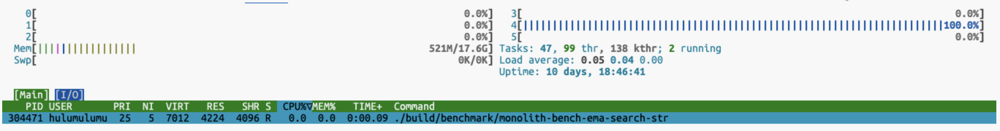

#### Выводы:

  - **Распределение времени выполнения**:
    - Утилита `time` показала, что процесс выполняется за **0.555 секунды**, из которых **0.26 секунды** (47%) приходится на пользовательское время (%USER) и **0.29 секунды** (52%) — на системное время (%SYS). Это указывает на активное взаимодействие с системными вызовами, связанными с чтением данных с диска.
    - Утилизация CPU близка к 100% (99% cpu), что подтверждает высокую нагрузку на процессор и систему ввода-вывода.

  - **Нагрузка на систему**:
    - Утилита `top` показала, что процесс занимает **100% CPU**, что согласуется с данными `time`. При этом основная нагрузка распределяется между пользовательским (%USER) и системным (%SYS) временем.
    - Нагрузка на систему в целом низкая (load average: 0.00, 0.02, 0.02), что указывает на отсутствие конкуренции за ресурсы со стороны других процессов.

  - **Эффективность работы с блоками данных**:
    - С увеличением размера блока (от 1024 до 65536 байт) время выполнения уменьшается, что подтверждает эффективность работы с большими блоками данных. Например, для блока 65536 байт время выполнения составляет **836967 наносекунд (0.84 мс)**, что значительно быстрее, чем для блока 1024 байт (**2304392 наносекунд** или **2.3 мс**).


### 2. **[short-path](./benchmark/monolith/ShortPathBench.cpp)** — Поиск кратчайшего пути в графе.

Выполним аналогичные команды, посмотрим на результаты и сделаем выводы.

`> time ./build/benchmark/monolith-bench-short-path`

```
2025-01-18T10:04:13+00:00
Running ./build/benchmark/monolith-bench-short-path
Run on (6 X 1999.99 MHz CPU s)
CPU Caches:
  L1 Data 32 KiB (x6)
  L1 Instruction 32 KiB (x6)
  L2 Unified 4096 KiB (x3)
  L3 Unified 16384 KiB (x1)
Load Average: 0.00, 0.00, 0.00
---------------------------------------------------------------------
Benchmark                           Time             CPU   Iterations
---------------------------------------------------------------------
BM_Dijkstra/iterations:100   23573129 ns     23570914 ns          100
./build/benchmark/monolith-bench-short-path  2.37s user 0.01s system 99% cpu 2.381 total
```

`> ./build/benchmark/monolith-bench-short-path > /dev/null & top -p $!`

```
top - 10:05:31 up 10 days, 18:56,  2 users,  load average: 0.02, 0.01, 0.00
Tasks:   1 total,   1 running,   0 sleeping,   0 stopped,   0 zombie
%Cpu(s):  0.0 us,  1.6 sy, 16.4 ni, 82.0 id,  0.0 wa,  0.0 hi,  0.0 si,  0.0 st 
MiB Mem :  17983.7 total,  14703.5 free,    890.9 used,   2772.2 buff/cache     
MiB Swap:      0.0 total,      0.0 free,      0.0 used.  17092.7 avail Mem 

    PID USER      PR  NI    VIRT    RES    SHR S  %CPU  %MEM     TIME+ COMMAND                                                                                                                                                                 
 305540 hulumul+  25   5    9052   6144   4096 R 100.0   0.0   0:00.20 monolith-bench-short-path
 ```

`> ./build/benchmark/monolith-bench-short-path > /dev/null & htop -p $!`

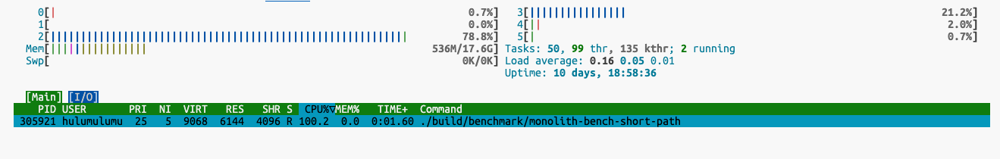

#### Выводы:

  1. **Распределение времени выполнения**:
    - Утилита `time` показала, что процесс выполняется за **2.381 секунды**, из которых **2.37 секунды** (99.5%) приходится на пользовательское время (%USER) и **0.01 секунды** (0.5%) — на системное время (%SYS). Это указывает на то, что основная нагрузка ложится на вычислительные ресурсы процессора, а не на системные вызовы.
    - Утилизация CPU близка к 100% (99% cpu), что подтверждает высокую нагрузку на процессор.

  2. **Нагрузка на систему**:
    - Утилита `top` показала, что процесс занимает **100% CPU**, что согласуется с данными `time`. При этом почти всё время выполнения приходится на пользовательские вычисления (%USER), что характерно для вычислительно сложных задач.
    - Нагрузка на систему в целом низкая (load average: 0.02, 0.01, 0.00), что указывает на отсутствие конкуренции за ресурсы со стороны других процессов.

  3. **Характеристики выполнения**:
    - Время выполнения одной итерации алгоритма Дейкстры составляет **23 570 914 наносекунд** (23.57 мс) для графа с 10 000 вершин и 100 000 рёбер.
    - Количество итераций — 100, что позволяет получить стабильные и достоверные результаты.

## Увеличение количества нагрузчиков

### 1. **[ema-search-str](./benchmark/monolith/EmaSearchStrBench.cpp)** — Поиск подстроки в тексте, расположенном во внешней памяти.

#### **1 поток**

`> time ./build/benchmark/monolith-bench-ema-search-str`

```
2025-01-18T10:20:20+00:00
Running ./build/benchmark/monolith-bench-ema-search-str
Run on (6 X 1999.99 MHz CPU s)
CPU Caches:
  L1 Data 32 KiB (x6)
  L1 Instruction 32 KiB (x6)
  L2 Unified 4096 KiB (x3)
  L3 Unified 16384 KiB (x1)
Load Average: 0.03, 0.05, 0.01
--------------------------------------------------------------------------------------------------
Benchmark                                                        Time             CPU   Iterations
--------------------------------------------------------------------------------------------------
BM_SubstringSearchInFile/1024/iterations:100/threads:1     2291873 ns      2291875 ns          100
BM_SubstringSearchInFile/4096/iterations:100/threads:1     1471323 ns      1471156 ns          100
BM_SubstringSearchInFile/16384/iterations:100/threads:1     885972 ns       885984 ns          100
BM_SubstringSearchInFile/65536/iterations:100/threads:1     859796 ns       859809 ns          100
./build/benchmark/monolith-bench-ema-search-str  0.30s user 0.26s system 99% cpu 0.554 total
```

`> ./build/benchmark/monolith-bench-ema-search-str > /dev/null & top -p $!`

```
top - 10:21:32 up 10 days, 19:13,  2 users,  load average: 0.04, 0.05, 0.01
Tasks:   1 total,   1 running,   0 sleeping,   0 stopped,   0 zombie
%Cpu(s):  0.0 us,  6.5 sy, 11.3 ni, 82.3 id,  0.0 wa,  0.0 hi,  0.0 si,  0.0 st 
MiB Mem :  17983.7 total,  14699.6 free,    893.9 used,   2773.1 buff/cache     
MiB Swap:      0.0 total,      0.0 free,      0.0 used.  17089.7 avail Mem 

    PID USER      PR  NI    VIRT    RES    SHR S  %CPU  %MEM     TIME+ COMMAND                                                                                   
 307716 hulumul+  25   5    7012   4224   4096 R 100.0   0.0   0:00.19 monolith-bench-search-str
```

`> ./build/benchmark/monolith-bench-ema-search-str > /dev/null & htop -p $!`


- **Время выполнения**: 0.554 секунды.
- **Нагрузка на CPU**: 100% (1 поток).
- **Распределение времени**: 0.30s user, 0.26s system.
- **Вывод**: Процесс полностью загружает одно ядро процессора, при этом время выполнения распределено между пользовательскими вычислениями и системными вызовами, связанными с чтением данных с диска.

#### **4 потока**

`> time ./build/benchmark/monolith-bench-ema-search-str`

```
2025-01-18T10:23:40+00:00
Running ./build/benchmark/monolith-bench-ema-search-str
Run on (6 X 1999.99 MHz CPU s)
CPU Caches:
  L1 Data 32 KiB (x6)
  L1 Instruction 32 KiB (x6)
  L2 Unified 4096 KiB (x3)
  L3 Unified 16384 KiB (x1)
Load Average: 0.12, 0.06, 0.01
--------------------------------------------------------------------------------------------------
Benchmark                                                        Time             CPU   Iterations
--------------------------------------------------------------------------------------------------
BM_SubstringSearchInFile/1024/iterations:100/threads:4     2859293 ns      2859003 ns          400
BM_SubstringSearchInFile/4096/iterations:100/threads:4     1952734 ns      1952197 ns          400
BM_SubstringSearchInFile/16384/iterations:100/threads:4    1224898 ns      1224740 ns          400
BM_SubstringSearchInFile/65536/iterations:100/threads:4    1040123 ns      1039736 ns          400
./build/benchmark/monolith-bench-ema-search-str  1.47s user 1.37s system 338% cpu 0.838 total
```

`> ./build/benchmark/monolith-bench-ema-search-str > /dev/null & top -p $!`

```
top - 10:24:21 up 10 days, 19:15,  2 users,  load average: 0.06, 0.05, 0.00
Tasks:   1 total,   1 running,   0 sleeping,   0 stopped,   0 zombie
%Cpu(s):  1.6 us, 21.3 sy, 45.9 ni, 31.1 id,  0.0 wa,  0.0 hi,  0.0 si,  0.0 st 
MiB Mem :  17983.7 total,  14699.9 free,    893.6 used,   2773.2 buff/cache     
MiB Swap:      0.0 total,      0.0 free,      0.0 used.  17090.1 avail Mem 

    PID USER      PR  NI    VIRT    RES    SHR S  %CPU  %MEM     TIME+ COMMAND                                                                                   
 308537 hulumul+  25   5  228208   4224   4096 R 400.0   0.0   0:00.80 monolith-bench-search-str
```

`> ./build/benchmark/monolith-bench-ema-search-str > /dev/null & htop -p $!`

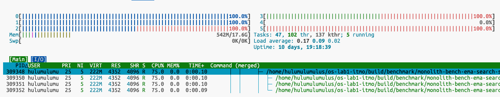

- **Время выполнения**: 0.838 секунды.
- **Нагрузка на CPU**: 338% (4 потока).
- **Распределение времени**: 1.47s user, 1.37s system.
- **Вывод**: Увеличение количества потоков до 4 привело к росту нагрузки на CPU до 338%. Время выполнения увеличилось, так как в каждом потоке запускается тот же самый алгоритм, что приводит к увеличению общего объема работы.

#### **8 потоков**

`> time ./build/benchmark/monolith-bench-ema-search-str`

```
2025-01-18T10:29:16+00:00
Running ./build/benchmark/monolith-bench-ema-search-str
Run on (6 X 1999.99 MHz CPU s)
CPU Caches:
  L1 Data 32 KiB (x6)
  L1 Instruction 32 KiB (x6)
  L2 Unified 4096 KiB (x3)
  L3 Unified 16384 KiB (x1)
Load Average: 0.09, 0.07, 0.01
--------------------------------------------------------------------------------------------------
Benchmark                                                        Time             CPU   Iterations
--------------------------------------------------------------------------------------------------
BM_SubstringSearchInFile/1024/iterations:100/threads:8     5179667 ns      3942905 ns          800
BM_SubstringSearchInFile/4096/iterations:100/threads:8     3183265 ns      2506592 ns          800
BM_SubstringSearchInFile/16384/iterations:100/threads:8    2049697 ns      1591126 ns          800
BM_SubstringSearchInFile/65536/iterations:100/threads:8    1693511 ns      1298340 ns          800
./build/benchmark/monolith-bench-ema-search-str  4.07s user 3.41s system 527% cpu 1.418 total
```

`> ./build/benchmark/monolith-bench-ema-search-str > /dev/null & top -p $!`

```
top - 10:29:44 up 10 days, 19:21,  2 users,  load average: 0.75, 0.21, 0.06
Tasks:   1 total,   1 running,   0 sleeping,   0 stopped,   0 zombie
%Cpu(s):  0.0 us, 34.4 sy, 65.6 ni,  0.0 id,  0.0 wa,  0.0 hi,  0.0 si,  0.0 st 
MiB Mem :  17983.7 total,  14692.3 free,    900.8 used,   2773.5 buff/cache     
MiB Swap:      0.0 total,      0.0 free,      0.0 used.  17082.8 avail Mem 

    PID USER      PR  NI    VIRT    RES    SHR S  %CPU  %MEM     TIME+ COMMAND                                                                                   
 310155 hulumul+  25   5  523136   4352   4096 R 600.0   0.0   0:01.21 monolith-bench-                                                                           
```

`> ./build/benchmark/monolith-bench-ema-search-str > /dev/null & htop -p $!`

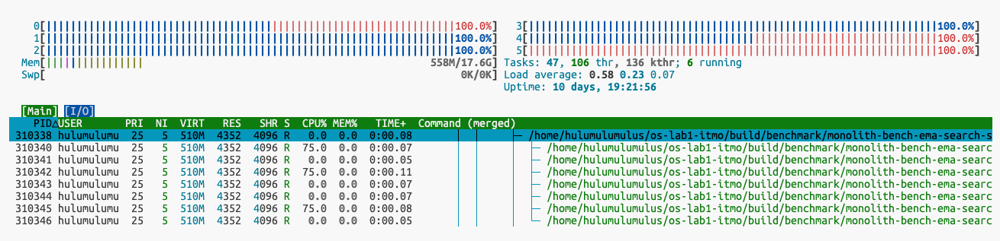

- **Время выполнения**: 1.418 секунд.
- **Нагрузка на CPU**: 527% (8 потоков).
- **Распределение времени**: 4.07s user, 3.41s system.
- **Вывод**: При 8 потоках нагрузка на CPU достигла 527%.

#### **16 потоков**

`> time ./build/benchmark/monolith-bench-ema-search-str`

```
2025-01-18T10:31:39+00:00
Running ./build/benchmark/monolith-bench-ema-search-str
Run on (6 X 1999.99 MHz CPU s)
CPU Caches:
  L1 Data 32 KiB (x6)
  L1 Instruction 32 KiB (x6)
  L2 Unified 4096 KiB (x3)
  L3 Unified 16384 KiB (x1)
Load Average: 0.60, 0.35, 0.13
---------------------------------------------------------------------------------------------------
Benchmark                                                         Time             CPU   Iterations
---------------------------------------------------------------------------------------------------
BM_SubstringSearchInFile/1024/iterations:100/threads:16    10104102 ns      3999858 ns         1600
BM_SubstringSearchInFile/4096/iterations:100/threads:16     6356412 ns      2624466 ns         1600
BM_SubstringSearchInFile/16384/iterations:100/threads:16    3693188 ns      1617534 ns         1600
BM_SubstringSearchInFile/65536/iterations:100/threads:16    3291974 ns      1326827 ns         1600
./build/benchmark/monolith-bench-ema-search-str  8.35s user 6.97s system 584% cpu 2.622 total
```

`> ./build/benchmark/monolith-bench-ema-search-str > /dev/null & top -p $!`

```
top - 10:32:01 up 10 days, 19:23,  2 users,  load average: 0.43, 0.32, 0.12
Tasks:   1 total,   1 running,   0 sleeping,   0 stopped,   0 zombie
%Cpu(s):  0.0 us, 35.9 sy, 64.1 ni,  0.0 id,  0.0 wa,  0.0 hi,  0.0 si,  0.0 st 
MiB Mem :  17983.7 total,  14695.6 free,    897.3 used,   2773.8 buff/cache     
MiB Swap:      0.0 total,      0.0 free,      0.0 used.  17086.4 avail Mem 

    PID USER      PR  NI    VIRT    RES    SHR S  %CPU  %MEM     TIME+ COMMAND                                                                                   
 311236 hulumul+  25   5 1112992   4480   4096 R 581.8   0.0   0:01.25 monolith-bench-
```

`> ./build/benchmark/monolith-bench-ema-search-str > /dev/null & htop -p $!`

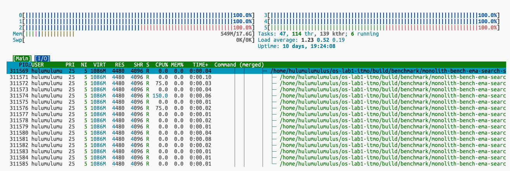

- **Время выполнения**: 2.622 секунды.
- **Нагрузка на CPU**: 584% (16 потоков).
- **Распределение времени**: 8.35s user, 6.97s system.
- **Вывод**: При 16 потоках нагрузка на CPU достигла 584%, но время выполнения увеличилось почти в 5 раз по сравнению с 1 потоком. Это связано с тем, что мы достигли максимальной мощности машины и дальнейшее увеличение потоков приведет к ещё худгму времени выполнения.

#### Общий вывод

Увеличение количества потоков в задачах, связанных с поиском подстроки в тексте, расположенном во внешней памяти, имеет ограниченную эффективность из-за ограничений ввода-вывода. Оптимальное количество потоков для данной задачи — 6, равное количеству ядер процессора.

### 2. **[short-path](./benchmark/monolith/ShortPathBench.cpp)** — Поиск кратчайшего пути в графе.

#### **1 поток**

`> time ./build/benchmark/monolith-bench-short-path`

```
2025-01-18T10:38:35+00:00
Running ./build/benchmark/monolith-bench-short-path
Run on (6 X 1999.99 MHz CPU s)
CPU Caches:
  L1 Data 32 KiB (x6)
  L1 Instruction 32 KiB (x6)
  L2 Unified 4096 KiB (x3)
  L3 Unified 16384 KiB (x1)
Load Average: 4.27, 2.27, 0.95
-------------------------------------------------------------------------------
Benchmark                                     Time             CPU   Iterations
-------------------------------------------------------------------------------
BM_Dijkstra/iterations:100/threads:1   22875390 ns     22873369 ns          100
./build/benchmark/monolith-bench-short-path  2.31s user 0.01s system 99% cpu 2.311 total
```

`> ./build/benchmark/monolith-bench-short-path > /dev/null & top -p $!`

```
top - 10:38:53 up 10 days, 19:30,  2 users,  load average: 3.33, 2.16, 0.94
Tasks:   1 total,   1 running,   0 sleeping,   0 stopped,   0 zombie
%Cpu(s):  0.0 us,  0.0 sy, 16.7 ni, 80.0 id,  3.3 wa,  0.0 hi,  0.0 si,  0.0 st 
MiB Mem :  17983.7 total,  14683.9 free,    908.6 used,   2774.2 buff/cache     
MiB Swap:      0.0 total,      0.0 free,      0.0 used.  17075.0 avail Mem 

    PID USER      PR  NI    VIRT    RES    SHR S  %CPU  %MEM     TIME+ COMMAND                                                                                   
 313355 hulumul+  25   5    9044   6144   4096 R 100.0   0.0   0:00.20 monolith-bench-
```

`> ./build/benchmark/monolith-bench-short-path > /dev/null & htop -p $!`

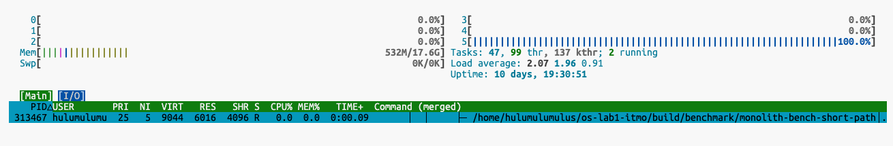

- **Время выполнения**: 2.311 секунды.
- **Нагрузка на CPU**: 100% (1 поток).
- **Распределение времени**: 2.31s user, 0.01s system.
- **Вывод**: Процесс полностью загружает одно ядро процессора. Время выполнения почти полностью приходится на пользовательские вычисления, что характерно для вычислительно сложных задач, таких как алгоритм Дейкстры.

#### **4 потока**

`> time ./build/benchmark/monolith-bench-short-path`

```
2025-01-18T10:40:47+00:00
Running ./build/benchmark/monolith-bench-short-path
Run on (6 X 1999.99 MHz CPU s)
CPU Caches:
  L1 Data 32 KiB (x6)
  L1 Instruction 32 KiB (x6)
  L2 Unified 4096 KiB (x3)
  L3 Unified 16384 KiB (x1)
Load Average: 0.60, 1.50, 0.84
-------------------------------------------------------------------------------
Benchmark                                     Time             CPU   Iterations
-------------------------------------------------------------------------------
BM_Dijkstra/iterations:100/threads:4   27683609 ns     27681006 ns          400
./build/benchmark/monolith-bench-short-path  11.17s user 0.02s system 343% cpu 3.253 total
```

`> ./build/benchmark/monolith-bench-short-path > /dev/null & top -p $!`

```
top - 10:41:19 up 10 days, 19:32,  2 users,  load average: 1.14, 1.53, 0.87
Tasks:   1 total,   1 running,   0 sleeping,   0 stopped,   0 zombie
%Cpu(s):  0.0 us,  1.7 sy, 65.0 ni, 33.3 id,  0.0 wa,  0.0 hi,  0.0 si,  0.0 st 
MiB Mem :  17983.7 total,  14692.0 free,    900.4 used,   2774.4 buff/cache     
MiB Swap:      0.0 total,      0.0 free,      0.0 used.  17083.2 avail Mem 

    PID USER      PR  NI    VIRT    RES    SHR S  %CPU  %MEM     TIME+ COMMAND                                                                                   
 314283 hulumul+  25   5  230956  11520   4096 R 400.0   0.1   0:00.79 monolith-bench-
```

`> ./build/benchmark/monolith-bench-short-path > /dev/null & htop -p $!`

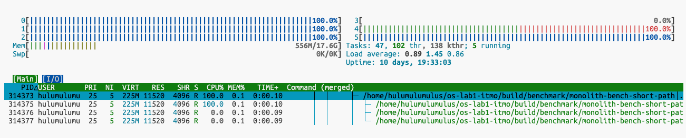

- **Время выполнения**: 3.253 секунды.
- **Нагрузка на CPU**: 343% (4 потока).
- **Распределение времени**: 11.17s user, 0.02s system.
- **Вывод**: Увеличение количества потоков до 4 привело к росту нагрузки на CPU до 343%.

#### **8 потоков**

`> time ./build/benchmark/monolith-bench-short-path`

```
2025-01-18T10:42:18+00:00
Running ./build/benchmark/monolith-bench-short-path
Run on (6 X 1999.99 MHz CPU s)
CPU Caches:
  L1 Data 32 KiB (x6)
  L1 Instruction 32 KiB (x6)
  L2 Unified 4096 KiB (x3)
  L3 Unified 16384 KiB (x1)
Load Average: 0.51, 1.29, 0.82
-------------------------------------------------------------------------------
Benchmark                                     Time             CPU   Iterations
-------------------------------------------------------------------------------
BM_Dijkstra/iterations:100/threads:8   49975189 ns     37709976 ns          800
./build/benchmark/monolith-bench-short-path  30.43s user 0.03s system 588% cpu 5.181 total
```

`> ./build/benchmark/monolith-bench-short-path > /dev/null & top -p $!`

```
top - 10:42:35 up 10 days, 19:34,  2 users,  load average: 0.86, 1.33, 0.85
Tasks:   1 total,   1 running,   0 sleeping,   0 stopped,   0 zombie
%Cpu(s):  1.5 us,  1.5 sy, 89.6 ni,  7.5 id,  0.0 wa,  0.0 hi,  0.0 si,  0.0 st 
MiB Mem :  17983.7 total,  14692.2 free,    900.1 used,   2774.5 buff/cache     
MiB Swap:      0.0 total,      0.0 free,      0.0 used.  17083.6 avail Mem 

    PID USER      PR  NI    VIRT    RES    SHR S  %CPU  %MEM     TIME+ COMMAND                                                                                   
 314988 hulumul+  25   5  526848  19296   4096 R 600.0   0.1   0:01.19 monolith-bench-
```

`> ./build/benchmark/monolith-bench-short-path > /dev/null & top -p $!`

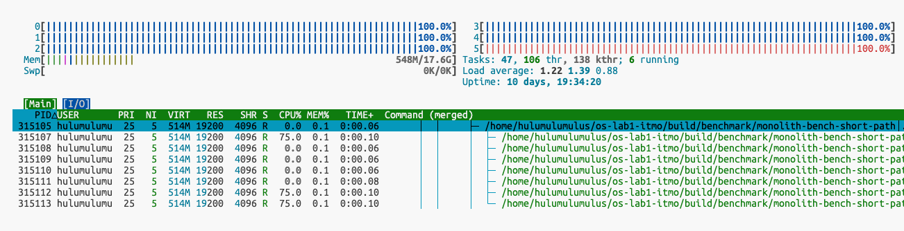

- **Время выполнения**: 5.181 секунды.
- **Нагрузка на CPU**: 588% (8 потоков).
- **Распределение времени**: 30.43s user, 0.03s system.
- **Вывод**: При 8 потоках нагрузка на CPU достигла 588%. Время выполнения увеличилось, так как каждый поток выполняет независимую копию алгоритма.

#### **16 потоков**

`> time ./build/benchmark/monolith-bench-short-path`

```
2025-01-18T10:43:22+00:00
Running ./build/benchmark/monolith-bench-short-path
Run on (6 X 1999.99 MHz CPU s)
CPU Caches:
  L1 Data 32 KiB (x6)
  L1 Instruction 32 KiB (x6)
  L2 Unified 4096 KiB (x3)
  L3 Unified 16384 KiB (x1)
Load Average: 1.16, 1.38, 0.89
--------------------------------------------------------------------------------
Benchmark                                      Time             CPU   Iterations
--------------------------------------------------------------------------------
BM_Dijkstra/iterations:100/threads:16   99236372 ns     38374429 ns         1600
./build/benchmark/monolith-bench-short-path  61.99s user 0.05s system 591% cpu 10.492 total
```

`> ./build/benchmark/monolith-bench-short-path > /dev/null & top -p $!`

```
top - 10:43:48 up 10 days, 19:35,  2 users,  load average: 2.68, 1.77, 1.03
Tasks:   1 total,   1 running,   0 sleeping,   0 stopped,   0 zombie
%Cpu(s):  0.0 us,  4.9 sy, 93.4 ni,  1.6 id,  0.0 wa,  0.0 hi,  0.0 si,  0.0 st 
MiB Mem :  17983.7 total,  14680.7 free,    911.4 used,   2774.6 buff/cache     
MiB Swap:      0.0 total,      0.0 free,      0.0 used.  17072.2 avail Mem 

    PID USER      PR  NI    VIRT    RES    SHR S  %CPU  %MEM     TIME+ COMMAND                                                                                   
 315736 hulumul+  25   5 1119772  34560   4096 R 600.0   0.2   0:01.20 monolith-bench-
```

`> ./build/benchmark/monolith-bench-short-path > /dev/null & htop -p $!`

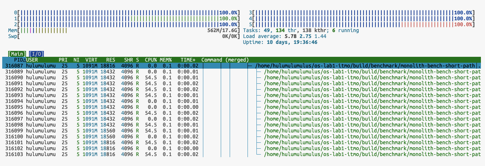

- **Вывод**: При 16 потоках нагрузка на CPU достигла 591%, но время выполнения увеличилось почти в 5 раз по сравнению с 1 потоком. Это связано с тем, что каждый поток выполняет независимую копию алгоритма, что приводит к значительному увеличению общего объема работы и конкуренции за ресурсы процессора.

#### Общий вывод

Увеличение количества потоков сильно увеличивает нагрузку на систему, задействуя больше ядер для работы.

## Комбинированный бенчмарк

Составим комбинированны бенчмарк, который включает в себя одновременное выполнение двух вышеописанных. Предположительно мы должны увидеть равномерную нагрузку на CPU и на диск.

### **[multi-bench](./benchmark/monolith/MultiBench.cpp)** — Комбинированный бенчмарк.

`> ./build/benchmark/monolith-bench-milti`

```
Running ./build/benchmark/monolith-bench-milti
Run on (6 X 1999.99 MHz CPU s)
CPU Caches:
  L1 Data 32 KiB (x6)
  L1 Instruction 32 KiB (x6)
  L2 Unified 4096 KiB (x3)
  L3 Unified 16384 KiB (x1)
Load Average: 0.15, 0.06, 0.08
------------------------------------------------------------------------------------
Benchmark                                          Time             CPU   Iterations
------------------------------------------------------------------------------------
BM_CombinedBenchmark/1024/iterations:100    25664531 ns     25663802 ns          100
BM_CombinedBenchmark/4096/iterations:100    24482844 ns     24481134 ns          100
BM_CombinedBenchmark/16384/iterations:100   23779874 ns     23778452 ns          100
BM_CombinedBenchmark/65536/iterations:100   23919418 ns     23917709 ns          100
```

`> sudo perf stat ./build/benchmark/monolith-bench-milti`

```
 Performance counter stats for './build/benchmark/monolith-bench-milti':
          9,908.48 msec task-clock                       #    1.000 CPUs utilized             
                29      context-switches                 #    2.927 /sec                      
                 0      cpu-migrations                   #    0.000 /sec                      
             3,163      page-faults                      #  319.221 /sec                      
   <not supported>      cycles                                                                
   <not supported>      instructions                                                          
   <not supported>      branches                                                              
   <not supported>      branch-misses                                                         

       9.909449739 seconds time elapsed

       9.480687000 seconds user
       0.427987000 seconds sys
```

`> time ./build/benchmark/monolith-bench-milti`
```
2025-01-18T11:34:14+00:00
Running ./build/benchmark/monolith-bench-milti
Run on (6 X 1999.99 MHz CPU s)
CPU Caches:
  L1 Data 32 KiB (x6)
  L1 Instruction 32 KiB (x6)
  L2 Unified 4096 KiB (x3)
  L3 Unified 16384 KiB (x1)
Load Average: 0.27, 0.11, 0.10
------------------------------------------------------------------------------------
Benchmark                                          Time             CPU   Iterations
------------------------------------------------------------------------------------
BM_CombinedBenchmark/1024/iterations:100    25440955 ns     25440449 ns          100
BM_CombinedBenchmark/4096/iterations:100    24615683 ns     24615215 ns          100
BM_CombinedBenchmark/16384/iterations:100   24326351 ns     24325272 ns          100
BM_CombinedBenchmark/65536/iterations:100   24039251 ns     24037517 ns          100
./build/benchmark/monolith-bench-milti  9.47s user 0.45s system 99% cpu 9.925 total
```

`> ./build/benchmark/monolith-bench-milti > /dev/null & top -p $!`

```
top - 11:34:44 up 10 days, 20:26,  2 users,  load average: 0.27, 0.13, 0.10
Tasks:   1 total,   1 running,   0 sleeping,   0 stopped,   0 zombie
%Cpu(s):  0.1 us,  1.0 sy, 15.8 ni, 83.0 id,  0.0 wa,  0.0 hi,  0.0 si,  0.0 st 
MiB Mem :  17983.7 total,  14670.2 free,    918.0 used,   2778.8 buff/cache     
MiB Swap:      0.0 total,      0.0 free,      0.0 used.  17065.6 avail Mem 

    PID USER      PR  NI    VIRT    RES    SHR S  %CPU  %MEM     TIME+ COMMAND                                                                              
 323706 hulumul+  25   5    9068   6200   4224 R 100.0   0.0   0:03.20 monolith-bench-
```

`> ./build/benchmark/monolith-bench-milti > /dev/null & htop -p $!`

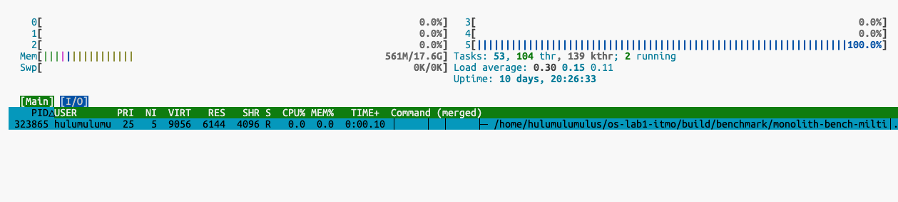

## Запуск комбинированного бенчмарка с агрессивными оптимизациями

Добавим `add_compile_options(-Ofast)` в cmake

`> ./build/benchmark/monolith-bench-milti`

```
2025-01-18T11:44:08+00:00
Running ./build/benchmark/monolith-bench-milti
Run on (6 X 1999.99 MHz CPU s)
CPU Caches:
  L1 Data 32 KiB (x6)
  L1 Instruction 32 KiB (x6)
  L2 Unified 4096 KiB (x3)
  L3 Unified 16384 KiB (x1)
Load Average: 0.02, 0.07, 0.08
------------------------------------------------------------------------------------
Benchmark                                          Time             CPU   Iterations
------------------------------------------------------------------------------------
BM_CombinedBenchmark/1024/iterations:100     5041651 ns      5041438 ns          100
BM_CombinedBenchmark/4096/iterations:100     4510550 ns      4510559 ns          100
BM_CombinedBenchmark/16384/iterations:100    4094728 ns      4094585 ns          100
BM_CombinedBenchmark/65536/iterations:100    4173710 ns      4173711 ns          100
```

`> sudo perf stat ./build/benchmark/monolith-bench-milti`

```
Performance counter stats for './build/benchmark/monolith-bench-milti':

          1,775.56 msec task-clock                       #    1.000 CPUs utilized             
                 4      context-switches                 #    2.253 /sec                      
                 0      cpu-migrations                   #    0.000 /sec                      
             3,176      page-faults                      #    1.789 K/sec                     
   <not supported>      cycles                                                                
   <not supported>      instructions                                                          
   <not supported>      branches                                                              
   <not supported>      branch-misses                                                         

       1.776001031 seconds time elapsed

       1.487969000 seconds user
       0.287998000 seconds sys
```

`> time ./build/benchmark/monolith-bench-milti`
```
2025-01-18T11:45:31+00:00
Running ./build/benchmark/monolith-bench-milti
Run on (6 X 1999.99 MHz CPU s)
CPU Caches:
  L1 Data 32 KiB (x6)
  L1 Instruction 32 KiB (x6)
  L2 Unified 4096 KiB (x3)
  L3 Unified 16384 KiB (x1)
Load Average: 0.00, 0.05, 0.07
------------------------------------------------------------------------------------
Benchmark                                          Time             CPU   Iterations
------------------------------------------------------------------------------------
BM_CombinedBenchmark/1024/iterations:100     4967506 ns      4966901 ns          100
BM_CombinedBenchmark/4096/iterations:100     4604591 ns      4604595 ns          100
BM_CombinedBenchmark/16384/iterations:100    4164137 ns      4163927 ns          100
BM_CombinedBenchmark/65536/iterations:100    4125752 ns      4125539 ns          100
./build/benchmark/monolith-bench-milti  1.51s user 0.30s system 99% cpu 1.811 total
```

`> ./build/benchmark/monolith-bench-milti > /dev/null & top -p $!`

```
top - 11:45:57 up 10 days, 20:37,  2 users,  load average: 0.00, 0.04, 0.07
Tasks:   1 total,   1 running,   0 sleeping,   0 stopped,   0 zombie
%Cpu(s):  0.0 us,  3.3 sy, 13.3 ni, 83.3 id,  0.0 wa,  0.0 hi,  0.0 si,  0.0 st 
MiB Mem :  17983.7 total,  14670.7 free,    917.1 used,   2779.3 buff/cache     
MiB Swap:      0.0 total,      0.0 free,      0.0 used.  17066.5 avail Mem 

    PID USER      PR  NI    VIRT    RES    SHR S  %CPU  %MEM     TIME+ COMMAND                                                                              
 325544 hulumul+  25   5    9048   6144   4096 R 100.0   0.0   0:00.20 monolith-bench-
```

`> ./build/benchmark/monolith-bench-milti > /dev/null & htop -p $!`

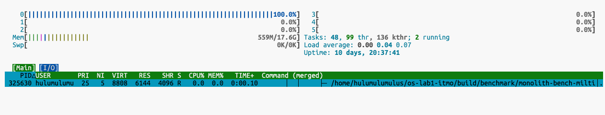

### Общий вывод

С точки зрения работы операционной системы, результаты комбинированного бенчмарка демонстрируют эффективное взаимодействие различных компонентов ОС. Планировщик процессов обеспечивает стабильное выделение ресурсов CPU, поддерживая высокую утилизацию одного ядра без значительных прерываний. ОС успешно балансирует операции ввода-вывода и интенсивные вычисления, минимизируя задержки и обеспечивая эффективное выполнение обоих типов задач. Низкое количество контекстных переключений свидетельствует об оптимизации накладных расходов на управление процессами. Стабильная производительность при различных размерах блоков данных указывает на эффективное использование иерархии памяти и кэша процессора. В целом, бенчмарк показывает, что современные операционные системы хорошо справляются с управлением ресурсами и оптимизацией производительности в условиях смешанной нагрузки, эффективно балансируя различные операции.

## Вывод

В лабораторной работе я реализовал свой shell, который позволяет запускать программы и выводить время их выполнения.  
В процессе работы я научился использовать утилиты для диагностики и профилирования, а также оптимизации программ в операционной системе на базе ядра GNU/Linux. Мне очень понравилось, спасибо!

